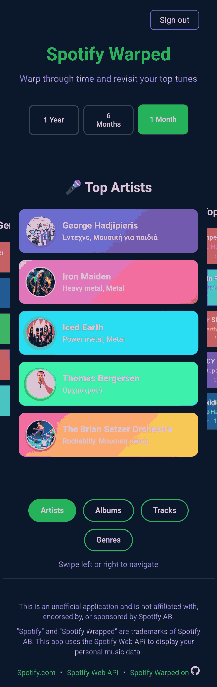
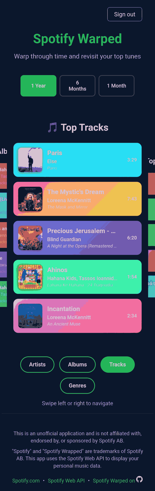

# Spotify Warped

[](https://reactjs.org/)
[](https://www.typescriptlang.org/)
[](https://tanstack.com/query/latest)
[](https://developer.mozilla.org/en-US/docs/Web/HTML)
[](https://developer.mozilla.org/en-US/docs/Web/CSS)

A beautiful, interactive React + TypeScript application that creates your personalized "Spotify Warped" experience. Navigate through your top music data with an immersive carousel interface and warp-like loading animations.


|  |  |  |
|:---:|:---:|:---:|

## ✨ Features

### 🎵 **Music Data Visualization**
- **Top Genres**: Discover your most-listened music genres with vibrant gradient cards
- **Top Artists**: Browse your favorite artists with profile images and genre information
- **Top Albums**: Explore your most-played albums with beautiful artwork and metadata
- **Top Tracks**: View your favorite songs with album covers and detailed information

### 🎠 **Interactive Carousel Navigation**
- **3D Carousel Effect**: Navigate through different data views with smooth transitions
- **Multi-Input Support**: Keyboard, mouse, and touch navigation for all devices
  - **Keyboard Support**: Use arrow keys (← →) for seamless navigation
  - **Click Navigation**: Click on side items or navigation buttons to switch views
  - **Swipe Gestures**: Native mobile swipe support for touch devices
- **Visual Feedback**: Active states, hover effects, and drag cursors for enhanced user experience

### 🌊 **Immersive Loading Experience**
- **Warp Tunnel Effect**: Dynamic expanding circles create a "warping through time" animation
- **Progressive Loading**: Animated text and dots provide engaging feedback
- **Smart Caching**: Data persistence with 24-hour localStorage caching for faster subsequent loads

### 📊 **Advanced Data Management**
- **React Query Integration**: Powerful data fetching with automatic caching and background updates
- **Time Range Selection**: View your top music from different periods (1 year, 6 months, 1 month)
- **Optimistic Updates**: Smooth UI transitions with intelligent cache management
- **Background Sync**: Automatic data refresh and stale-while-revalidate patterns

### 🎯 **User Experience Excellence**
- **Responsive Design**: Optimized for desktop and mobile devices
- **Accessibility**: WCAG compliant with keyboard navigation and focus indicators
- **Clickable Previews**: Direct links to Spotify for artists, albums, and tracks
- **Modern UI**: Card-based design with gradients, shadows, and smooth animations

### 🔐 **Secure Authentication**
- **Spotify OAuth2 PKCE**: Secure authorization flow without client secrets
- **Token Management**: Automatic token refresh and secure storage
- **User Profile Integration**: Real user data with avatar dropdown menu

### ⚡ **Performance Optimizations**
- **Component Architecture**: Modular, reusable components with custom hooks (Carousel, WarpLoading, useSwipe)
- **React Query Caching**: Intelligent data fetching with stale-while-revalidate and background updates
- **Efficient State Management**: Query-based state with automatic cache invalidation
- **Touch Optimization**: Hardware-accelerated swipe gestures for smooth mobile experience
- **CSS Modules**: Organized styling with component-specific CSS files
- **Fast Development**: Built with Vite for lightning-fast development and builds

## 🚀 Quick Start

### Prerequisites
- Node.js (v16 or higher)
- npm or yarn
- Spotify Developer Account

### Setup Instructions

1. **Register Spotify Application**
   - Go to [Spotify Developer Dashboard](https://developer.spotify.com/dashboard)
   - Create a new application
   - Add redirect URI: `http://localhost:5173/`
   - Note your Client ID

2. **Environment Configuration**
   ```bash
   cp .env.example .env
   ```
   Update `.env` with your Spotify credentials:
   ```env
   VITE_SPOTIFY_CLIENT_ID=your_client_id_here
   VITE_SPOTIFY_REDIRECT_URI=http://localhost:5173/
   VITE_SPOTIFY_SCOPES=user-top-read user-read-private user-read-email
   ```

3. **Install Dependencies**
   ```bash
   # Using npm
   npm install
   
   # Using yarn
   yarn install
   ```

4. **Start Development Server**
   ```bash
   # Using npm
   npm run dev
   
   # Using yarn
   yarn dev
   ```

5. **Open & Authenticate**
   - Navigate to `http://localhost:5173`
   - Click "Sign in with Spotify"
   - Enjoy your personalized Spotify Warped experience!

## 🎮 How to Use

### Navigation
- **Keyboard**: Use `←` and `→` arrow keys to navigate between views
- **Mouse**: Click on navigation buttons or side carousel items, or drag to swipe
- **Touch**: Native swipe gestures (left/right) for intuitive mobile navigation
- **Multi-Platform**: Consistent experience across desktop, tablet, and mobile devices

### Data Views
1. **Genres**: Colorful cards showing your top music genres
2. **Artists**: Artist profiles with images and genre tags
3. **Albums**: Album artwork with artist and year information
4. **Tracks**: Song listings with album covers and duration

### Interactive Features
- Click any artist, album, or track card to open it in Spotify
- Hover effects provide visual feedback
- Responsive design adapts to your screen size

## 🏗️ Technical Architecture

### Component Structure
```
src/
├── api/
│   ├── spotify.ts            # React Query hooks for Spotify API
│   └── mockSpotify.ts        # Mock implementation for development
├── components/
│   ├── Carousel.tsx          # Main carousel with swipe navigation
│   ├── WarpLoading.tsx       # Loading animation
│   ├── ErrorMessage.tsx      # Custom error handling component
│   ├── GenreList.tsx         # Genre display component
│   ├── ArtistList.tsx        # Artist display component
│   ├── AlbumList.tsx         # Album display component
│   ├── TrackList.tsx         # Track display component
│   └── TopLists.tsx          # Main data container with time ranges
├── hooks/
│   ├── index.ts              # Hook exports
│   └── useSwipe.ts           # Custom swipe gesture hook
└── styles/                   # Component-specific CSS files
```

### Key Technologies
- **React 18**: Latest React with hooks and functional components
- **TypeScript**: Full type safety and enhanced developer experience
- **@tanstack/react-query**: Powerful data fetching and caching library
- **Custom Hooks**: Reusable logic with `useSwipe` for gesture handling
- **Vite**: Fast development server and optimized builds
- **CSS3**: Modern styling with grid, flexbox, and touch-optimized animations
- **Spotify Web API**: Official Spotify integration with OAuth2 PKCE

### Performance Features
- **React Query Caching**: Intelligent query caching with stale-while-revalidate patterns
- **Background Updates**: Automatic data refresh and cache synchronization
- **Custom Hook Architecture**: Reusable logic with `useSwipe` for gesture handling
- **Optimized Touch Events**: Hardware-accelerated swipe gestures for 60fps mobile experience
- **Efficient Rendering**: Query-based state management minimizes unnecessary re-renders
- **Progressive Loading**: Smooth loading states with engaging animations

## 🔒 Security & Privacy

### Authentication
- **OAuth2 PKCE Flow**: Secure client-only authentication without exposing client secrets
- **Token Management**: Automatic token validation and refresh handling
- **Secure Storage**: Tokens stored securely in localStorage with expiration

### Data Handling
- **Client-Only**: No backend server required - runs entirely in your browser
- **Privacy First**: Your data never leaves your device except for Spotify API calls
- **Cache Control**: Smart caching with automatic expiration for fresh data

### Production Considerations
- For production deployment, consider implementing:
  - Secure token refresh mechanisms
  - Server-side token validation
  - Enhanced error handling and logging
  - CDN deployment for optimal performance

## 🎨 Design Philosophy

### Visual Design
- **Spotify-Inspired**: Color scheme and styling inspired by Spotify's design language
- **Card-Based Layout**: Clean, modern card interface for easy data consumption
- **Gradient Backgrounds**: Unique color gradients for each component type
- **Smooth Animations**: Subtle transitions and hover effects enhance user experience

### Accessibility
- **Keyboard Navigation**: Full keyboard support for navigation
- **Screen Reader Friendly**: Proper ARIA labels and semantic HTML
- **Focus Management**: Clear focus indicators and logical tab order
- **Color Contrast**: High contrast ratios for better readability

### User Experience
- **Progressive Enhancement**: Works without JavaScript enabled (basic functionality)
- **Mobile-First**: Responsive design optimized for all screen sizes
- **Fast Loading**: Optimized loading states with engaging animations
- **Error Handling**: Graceful error states and recovery mechanisms

## 🤝 Contributing

Contributions are welcome! This project follows these guidelines:

### Development Setup
1. Fork the repository
2. Create a feature branch: `git checkout -b feature/amazing-feature`
3. Make your changes and test thoroughly
4. Commit with descriptive messages: `git commit -m 'Add amazing feature'`
5. Push to your fork: `git push origin feature/amazing-feature`
6. Open a Pull Request

### Code Standards
- **TypeScript**: Maintain type safety throughout
- **Component Architecture**: Keep components focused and reusable
- **CSS Organization**: Use component-specific CSS files
- **Accessibility**: Ensure WCAG compliance for new features

## 📄 License

This project is licensed under the MIT License. See the [LICENSE](LICENSE) file for details.

### Third-Party Acknowledgments
- **Spotify**: This application uses the Spotify Web API but is not affiliated with Spotify AB
- **React**: Built with React and the React ecosystem
- **Vite**: Powered by Vite for development and building

---

**Disclaimer**: Spotify Warped is an independent project and is not affiliated with, endorsed by, or sponsored by Spotify AB or any of its affiliates. "Spotify" is a trademark of Spotify AB. This application is for educational and personal use only.
